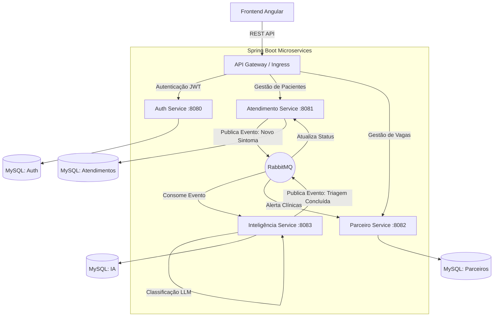

# 🏥 Acolhe Saúde: Ecossistema de Triagem e Encaminhamento Médico


> Uma plataforma digital inovadora desenvolvida para otimizar o atendimento médico emergencial em instituições de acolhimento. Combina uma **arquitetura robusta de microsserviços em Java/Spring Boot** com **Inteligência Artificial** para realizar triagens em tempo real, conectando cuidadores a uma rede de clínicas voluntárias.

---

## 🎯 O Problema e o Impacto

Em abrigos temporários e casas de acolhimento (como ILPIs), a identificação de urgências médicas é um desafio crítico:

- **Falta de Apoio Técnico:** Cuidadores sem formação médica têm dificuldade em avaliar a gravidade de sintomas.
- **Abismo Logístico:** Profissionais e clínicas desejam ajudar, mas não possuem um canal organizado para receber pacientes filantrópicos.
- **Sobrecarga Pública:** Casos simples sobrecarregam unidades de emergência do SUS, enquanto casos graves podem não receber a prioridade adequada.

**O Impacto Esperado (Foco em Guarulhos-SP):** Apoiar de 40 a 60 instituições, impactando diretamente **4.000 a 6.000 pessoas vulneráveis**, e evitando até **2.400 idas desnecessárias** ao pronto-socorro através de uma rede ágil de parceiros.

---

## 🚀 Funcionalidades Principais

### 🧑‍⚕️ Portal do Cuidador

- **Relato de Sintomas Assistido:** Interface intuitiva para descrever o estado do paciente.
- **Triagem IA em Tempo Real:** Motor de inteligência que analisa o relato e devolve o nível de risco (VERMELHO, AMARELO, VERDE) com diretrizes imediatas.
- **Encaminhamento Inteligente:** Listagem dinâmica de clínicas parceiras que possuem leitos disponíveis no momento exato da emergência.

### 🏥 Portal do Parceiro (Clínica/Médico)

- **Gestão de Capacidade:** Atualização em tempo real de leitos de UTI, Enfermaria e Médicos de Plantão.
- **Painel de Emergências:** Fila de atendimento ao vivo alimentada por *Polling* reativo.
- **Prontuário Integrado:** Visualização detalhada dos sinais vitais, comorbidades e análise preliminar da IA antes da admissão ou transferência do paciente.

---

## 🏗️ Arquitetura do Sistema (Microsserviços)

O Acolhe Saúde utiliza uma arquitetura distribuída (padrão *Database-per-Service*), garantindo escalabilidade, resiliência e separação de responsabilidades. O processamento da Inteligência Artificial ocorre de forma **assíncrona** para não bloquear a experiência do utilizador.



---

## 📂 Estrutura do Monorepo

```
📦 acolhe-saude
├── 📂 frontend                  # Aplicação Cliente (SPA)
│   ├── 📂 src/app
│   │   ├── 📂 components        # Componentes Standalone (Modais, Chat, etc)
│   │   ├── 📂 pages             # Ecrãs (Triagem, Dashboard, Login)
│   │   ├── 📂 services          # Integração HTTP com o Backend
│   │   └── 📄 app.routes.ts     # Proteção de Rotas (RoleGuard)
│   └── 📄 tailwind.config.js    # Estilização Global
│
└── 📂 backend                   # Ecossistema Spring Boot
    ├── 📂 auth-service          # Emissão e Validação de Tokens JWT
    ├── 📂 atendimento-service   # Lógica de Triagem e Pacientes
    ├── 📂 parceiro-service      # Gestão de Leitos e Aceite de Emergências
    └── 📂 inteligencia-service  # Integração com LLM (Prompt Engineering)
```

---

## 🛠️ Tecnologias Utilizadas

**Frontend:**
- Angular 17+ (Componentes Standalone e Control Flow)
- Tailwind CSS
- Lucide Icons

**Backend:**
- Java 17+
- Spring Boot 3
- Spring Security (JWT)
- Spring Data JPA / Hibernate

**Infraestrutura & Mensageria:**
- RabbitMQ (Comunicação Assíncrona e Event-Driven)
- MySQL (Bancos de dados isolados por domínio)

---

## ⚙️ Como Executar o Projeto Localmente

### Pré-requisitos

- Node.js v18+ e Angular CLI
- JDK 17 ou superior
- MySQL Server rodando na porta `3306`
- RabbitMQ rodando na porta `5672`
  > Recomendado via Docker:
  > ```bash
  > docker run -d -p 5672:5672 -p 15672:15672 rabbitmq:3-management
  > ```

### 1. Executar o Frontend

```bash
cd frontend
npm install
ng serve
# A aplicação estará disponível em http://localhost:4200
```

### 2. Executar os Microsserviços (Backend)

1. Crie os esquemas no MySQL para cada um dos serviços: `acolhe_auth`, `acolhe_atendimento`, `acolhe_parceiro` e `db_ia`.
2. Importe a pasta `backend` na sua IDE (IntelliJ IDEA, Eclipse ou VS Code).
3. Inicie os serviços na seguinte ordem recomendada:
   - `auth-service`
   - `atendimento-service`
   - `parceiro-service`
   - `inteligencia-service`

---

## 👥 Equipa de Desenvolvimento

Projeto de Trabalho de Conclusão de Curso (TCC) — Análise e Desenvolvimento de Sistemas | Centro Universitário ENIAC.

| Membro | RA | Responsabilidades |
|---|---|---|
| **Fernando Luiz Jasse Paulino Ramalho** | 241412024 | Desenvolvimento Backend (Java/Spring), Arquitetura de Microsserviços e Integração de IA |
| **Caio Tadeu Pereira Lima** | 243912024 | Desenvolvimento Frontend e UX/UI |

---

*Transformando tecnologia em cuidado. Desenvolvido para Guarulhos, desenhado para o mundo.* 💙
